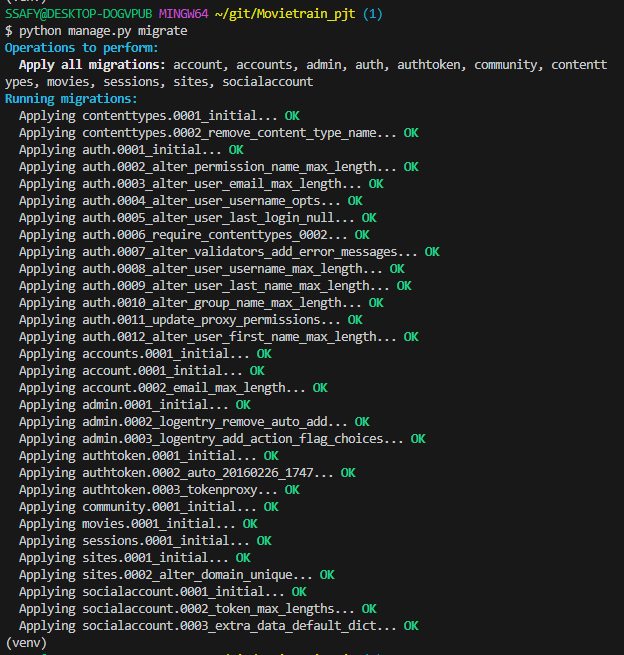

# 오늘 할 것
1. my_settings.py 
- 따로 key 관리하기

2. DB schema 완료하기
- login -> done
- movie - >done
- movie_comments -> done
- community -> done

데이터 모델링 순서
model.py 모델 생성-> serializer.py에서 serializerModel 생성 -> migrate 

like의 경우 foreignkey로 하며, ManyTOManyfields의 경우

------

### follower
- database_05_데이터베이스

# 오늘 한 것
- follower, like는 모두 ManyToManyFields -> table 생성
- auth 실패 -> 내일 다시 하기
- auth, request에서 시간 다 잡아먹었음, 내일 차근차근 따라가면서 하면 될 듯
- community -> auth -> post request 요청까지 확인
