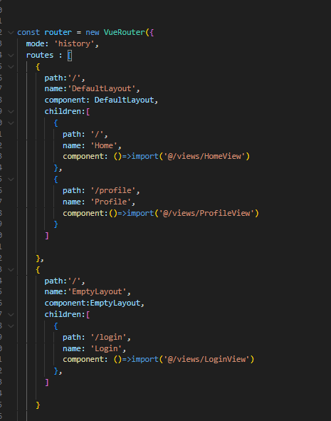
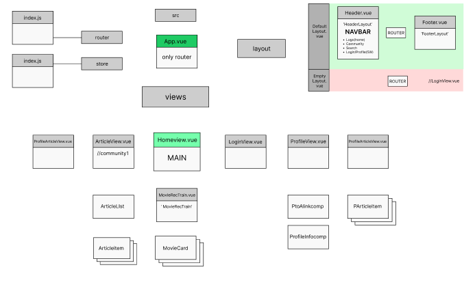
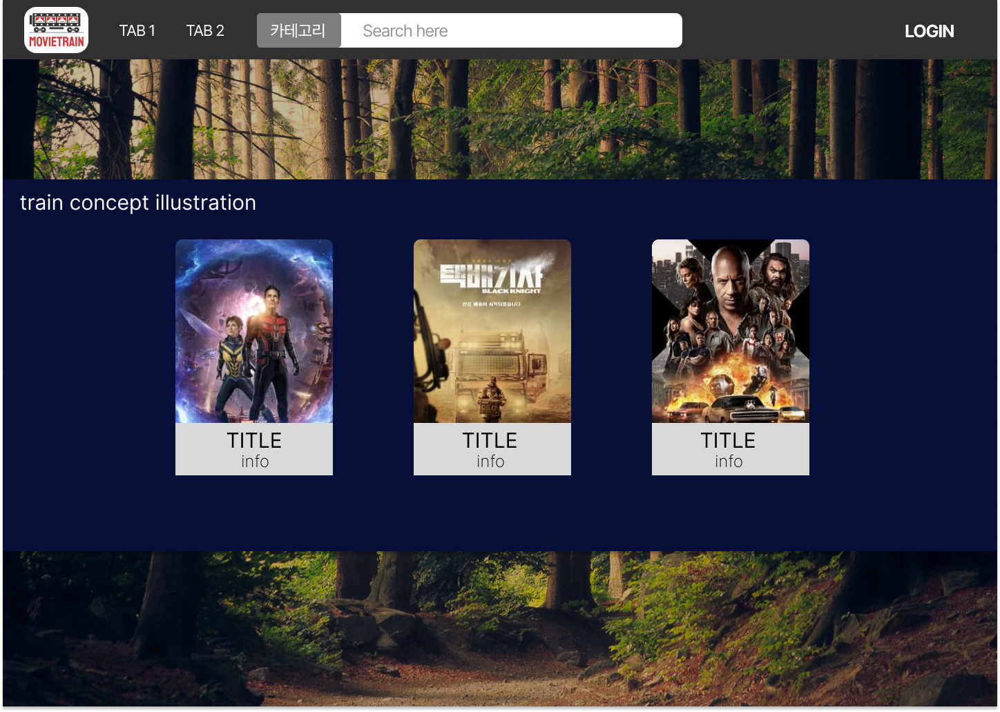
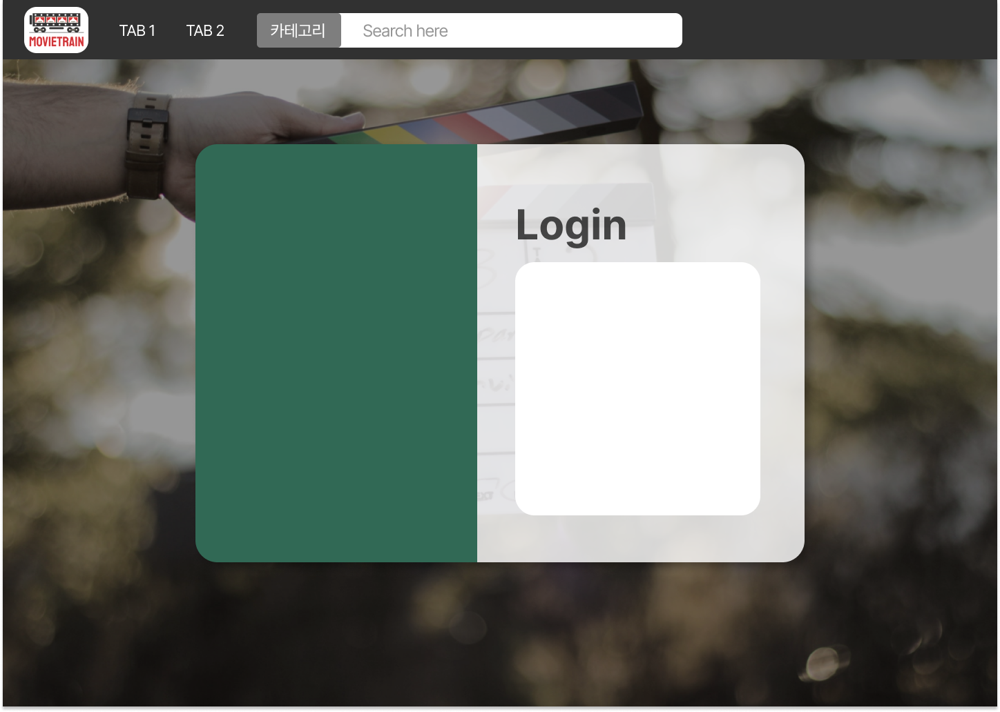
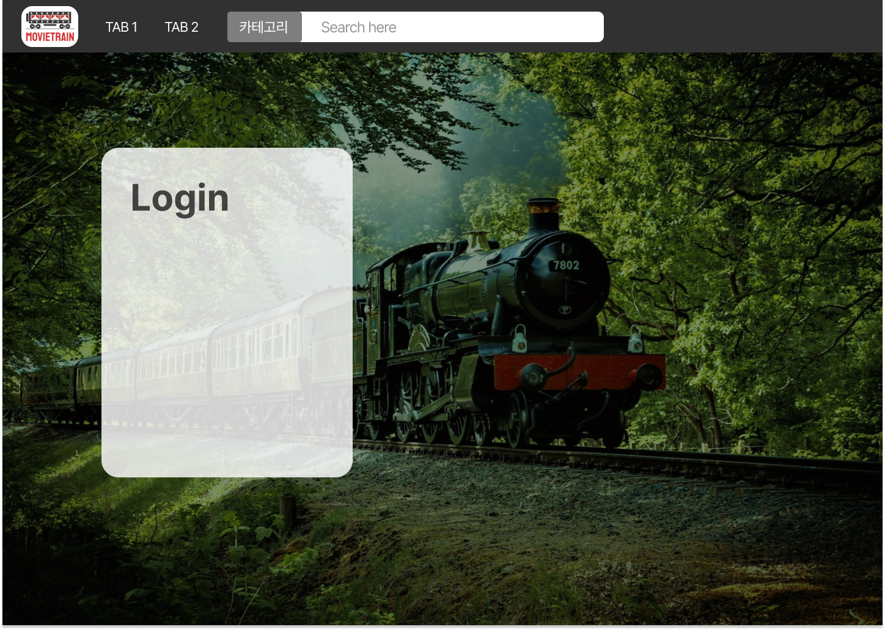

# [Movietrain] Day2_Frontend_YMY (0518)

## 오늘의 할일 

  1. DESIGN Layout 초안 완성 
     -  (Main, Login, 프로필)
  2. DESIGN Layout 관련 회의(오후)
  3. 로고 / 슬로건 관련 회의(오후)
  4. 컴포넌트 구성안 제작 및 수정 
  5. [Vue] 실제 컴포넌트 기초구조 구축 

  
-------------------
## 회의록
  1. (시간 남으면) 이용가이드 페이지 만들기
  2. (역시나 시간이 남으면) footer 구성 (일단 구조상 컴포구축 필요)
  3. detail page -> 게시글 댓글이 아닌 코멘트로 바꾸기
      - 별점 넣을 수 있는 시스템 구현 방법 찾기 
      - search 완료 (PM 3:20)
        - https://mdbootstrap.com/docs/b4/vue/plugins/rating/
        - bootstrap 5라서 호환이 될지는 모르겠음 
  4. 로고 / 슬로건 관련 회의(오후)
     1. 여행이라는 컨셉에 맞게 좀더 green하고 라이트한 느낌의 로고 찾기

------
  ## 진척도 

- ★★[Vue] Frontend 컴포넌트 기본구조 구축 
  - [Fix] 레이아웃(Navbar, footer)이 필요한 컴포들과, 필요없는 단일 컴포들(ex- login) 분리가 필요하다고 판단,
    - 레이아웃이 포함된 DefaultLayout과, 라우터만 있는 EmptyLayout으로 쪼갠 후
    - 라우트 세팅에서 필요에 따라 페이지들을 분리해서 용도에 맞게 라우팅되도록 세팅했음
    - 즉, Navbar등의 레이아웃이 필요한 컴포넌트들은 DefaultLayout.vue를 통해 라우팅패스를 설정하고,
    - 단일 페이지만 보여줘도 되는 컴포넌트들은 EmptyLayout.vue를 통해 라우팅하도록 설정했음.
     
- 컴포넌트 구성 제작 및 수정 (80%)
    
- 디자인 레퍼런스 수집
- 디자인 레이아웃 제작(60%)
  - main page 
    

  - Profile page 
  

  - login page
   
   

