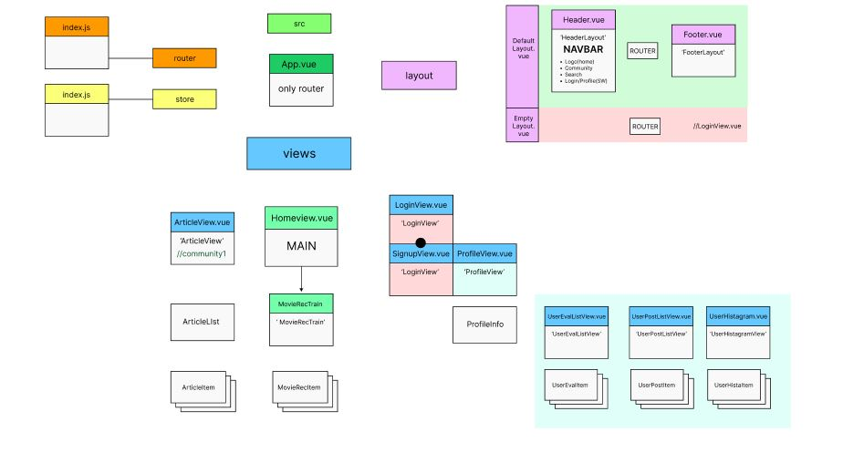
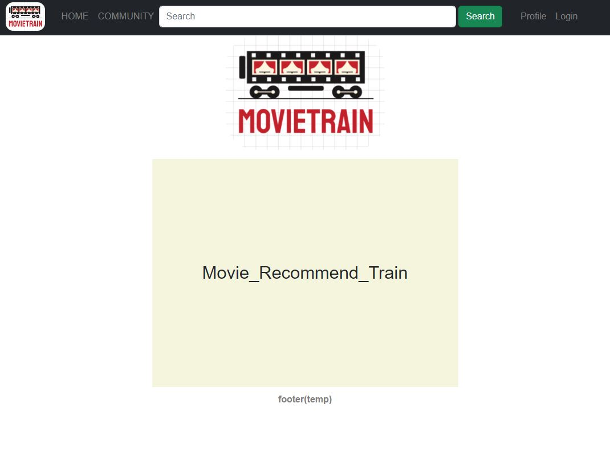
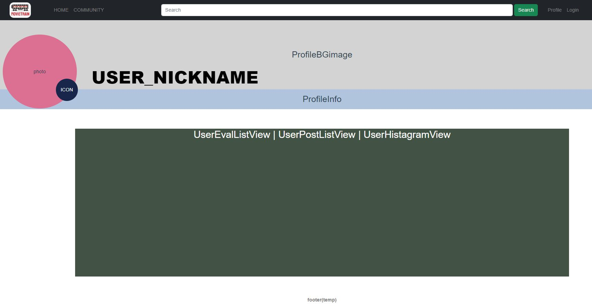
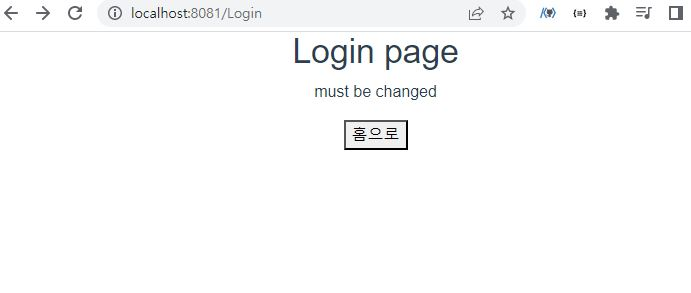

# [Movietrain] Day3_Frontend_YMY (0519)

## 오늘의 할일 

  1. DESIGN - 컬러톤 관련 회의(오후)
  2. DESIGN - 로고 / 슬로건 관련 회의(오후)
  3. 컴포넌트 구성안 제작 및 수정 
  4. [Vue] 
     1. 레이아웃(디자인) - HomeView, Header(navbar), ProfileView 뼈대 잡기
     2. 라우팅 - navbar의 요소들 클릭 시 해당 페이지로 이동 구현  

  
-------------------
## 회의록
  1. navbar 검색 기능 중 filter butten 구현 가능 여부?
  2. 로고 / 슬로건 관련 회의(오후)
     1. 여행이라는 컨셉에 맞게 좀더 green하고 라이트한 느낌의 로고 찾기
     2. green+yellow 톤으로 갈지, blue+pink 톤으로 갈지 고민중

------
  ## 진척도 

- ★★[Vue] Frontend 컴포넌트 기본구조 구축(BootStrap) 
- 컴포넌트 구성 제작 및 수정 (80%)
    
  - Navbar 요소 및 HomeView ,ProfileView 레이아웃 구축
     
  - Navbar 요소 클릭 시 해당 컴포넌트로 이동 구현(라우팅)
  - 프로필 페이지 레이아웃 현황 (추후 이미지 삽입 예정)
    
  - 로그인 페이지는 EmptyLayout소속(no navbar)이므로 홈으로 이동할 수 있도록 버튼을 따로 만들어서 이동 구현
    

