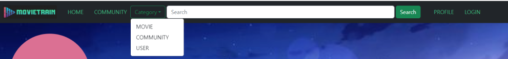
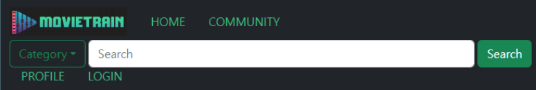
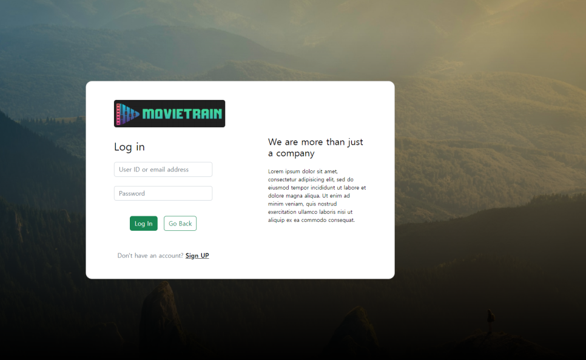
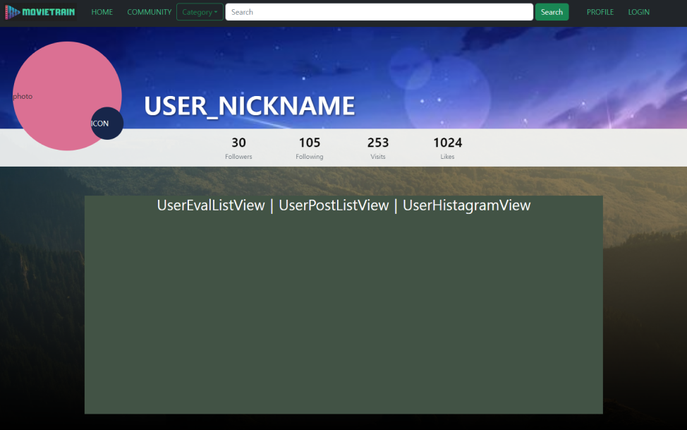
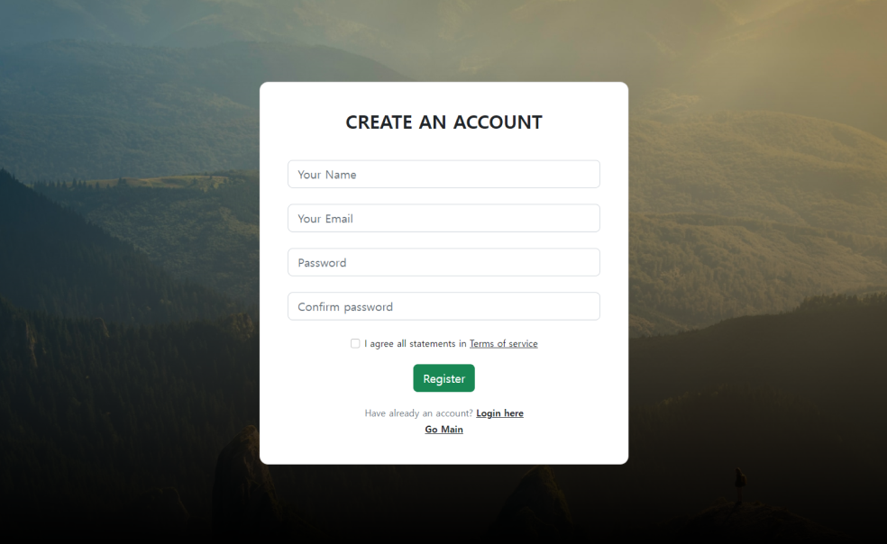
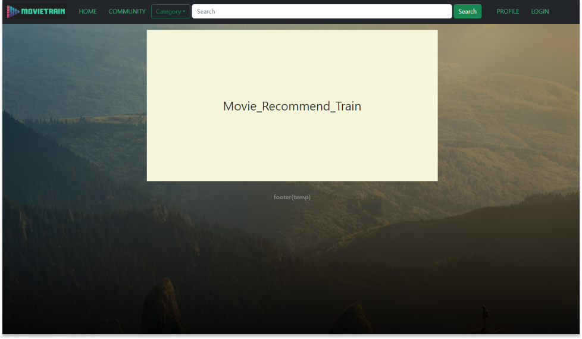

# [Movietrain] Day3_Frontend_YMY (0522)

## 오늘의 할일 

  1. DESIGN - 컬러톤, 로고, 슬로건 관련 회의(오후)
  
  2. 컴포넌트 구성안 제작 및 수정 
  3. [Vue] 
     1. 레이아웃(디자인) 
         - HomeView, Header(navbar), ProfileView 
         - 컬러톤 체크하며 develop시키기 
     2. 라우팅 - navbar의 요소들 클릭 시 해당 페이지로 이동 구현 (sign in 페이지 추가)  
     3. 반응형 NAVBAR 구성 (Display)
         - 기능추가: [Dropdown] Category, [Input] Search
     4. FORM DESIGN (Log in / Sign up)

  
-------------------
## 회의록
  1. navbar 검색 기능 중 filter butten 구현 가능 여부?
  2. 로고 / 슬로건 관련 회의(오후)
       - 로고 이미지 4안 중 1안 선택
        
  3. FEATURES - login 구현 방법(vue vs django)
       - 내일 점심 합칠 예정 

------
  ## 진척도 

- ★★[Vue] Frontend 컴포넌트 기본구조 구축(BootStrap) 
- 컴포넌트 구성 제작 및 수정 (진행중)
    
- 반응형 NavBar 제작 
    
    
- Log in Page 진행
    
- Profile Page 진행
    
- Sign Up Page 진행
    
- Main Page 진행
    