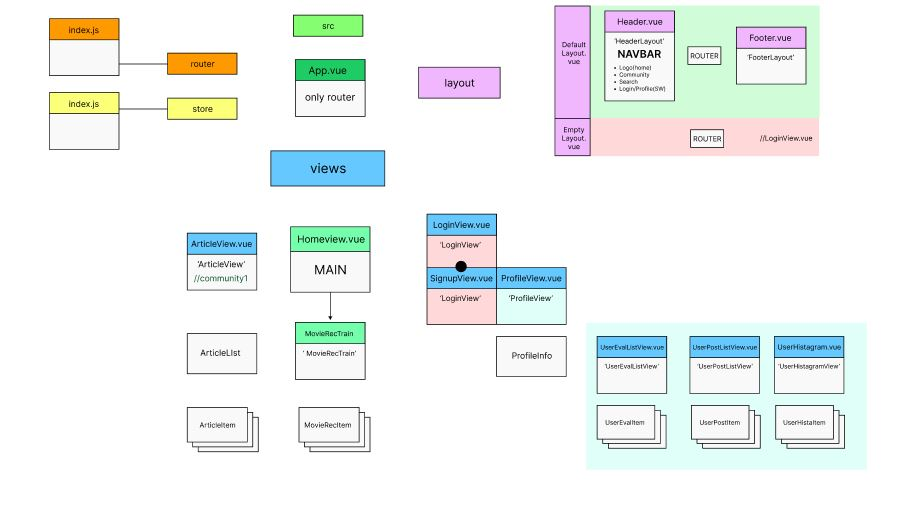
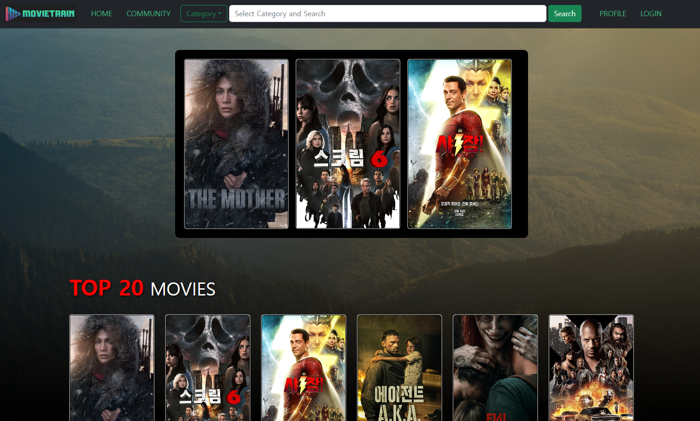
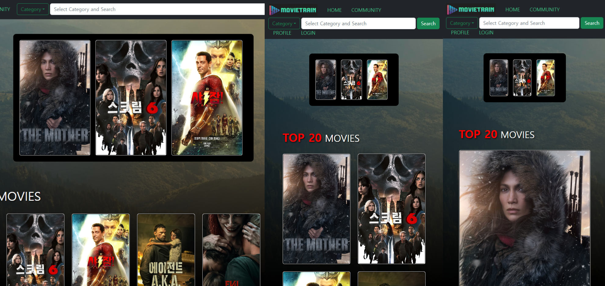
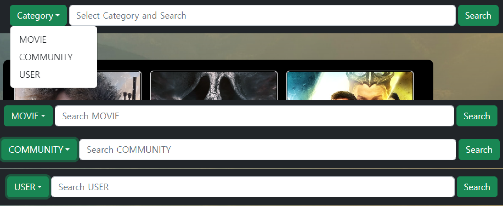
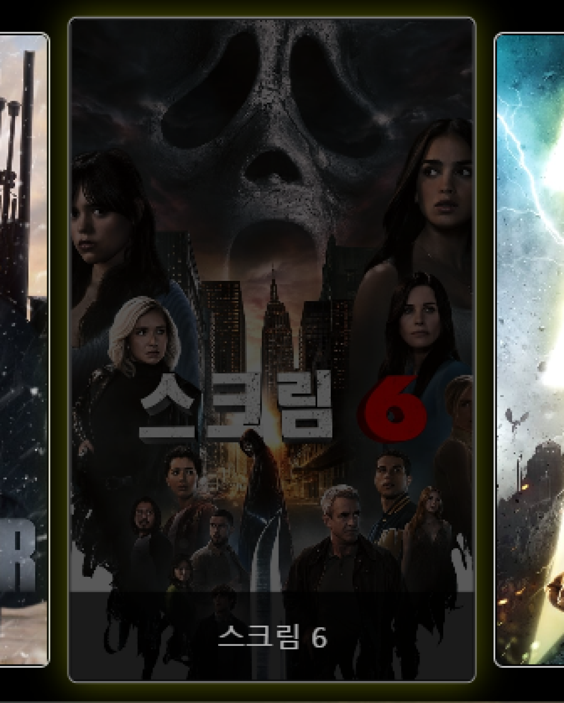
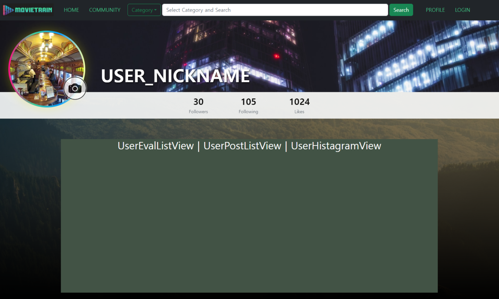
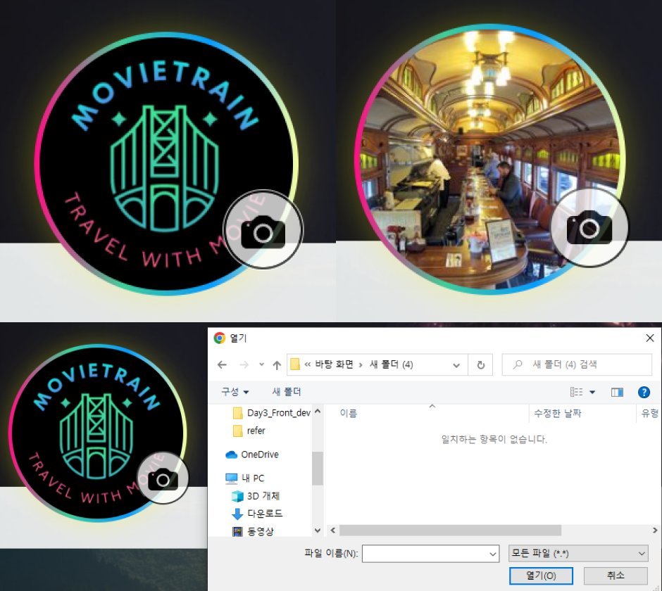
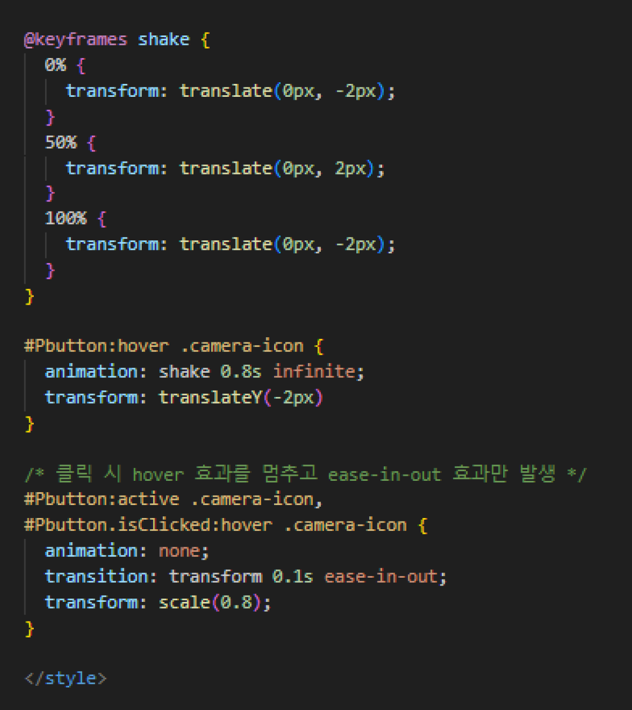

# [Movietrain] Day3_Frontend_YMY (0523)

## 오늘의 할일 

  1. DESIGN - MainView Layout, ProfileView Tone, Effect 관련 회의 (오후)
  
  2. 컴포넌트 구성안 지속 업데이트  
  3. [Vue] 
     1. 레이아웃(디자인) 
         - HomeView, Header(navbar), ProfileView 
         - 컬러톤 체크하며 develop시키기 
     2. 라우팅 - navbar의 요소들 클릭 시 해당 페이지로 이동 구현 (sign in 페이지 추가)  
     3. 반응형 NAVBAR 구성 (Display)
         - 기능추가: [Dropdown] Category -> 반응형 기능 구현 (text / placeholder 연동)
     4. MovieList, MovieRecTrain BackEnd 연동 (영화카드 - DB)

  
-------------------
## 회의록
  1. MainView Layout 
      - 3개의 메인 추천영화 (MovieRecTrain)
      - 20개의 top ranking 영화 (MovieList) 
  2. FEATURES - login 구현 방법(vue vs django)
       - 내일 점심 다시 합칠 예정 

------
  ## 진척도 

### ★★[Vue] Frontend 진행상황 
- 컴포넌트 구성 업데이트 
    
- Main Page 진행 (Display Size 반응형 구성 변경)
  - xxl size
    
  - xl, mid, sm size
    
  
- 반응형 NavBar 제작 
  - 기능추가: [Dropdown] Category -> 반응형 기능 구현 (text / placeholder 연동)
    
  - Effect 1: [Hover] 카드에 마우스 올리면 glow / zoom 효과
    
- Profile Page 진행
    
- 프로필 사진 변경 구현 
    
- 프로필 사진 변경버튼 Hover효과 구현
  - (마우스를 올리면 둥실둥실, 클릭하면 ease in out)
    
    
  