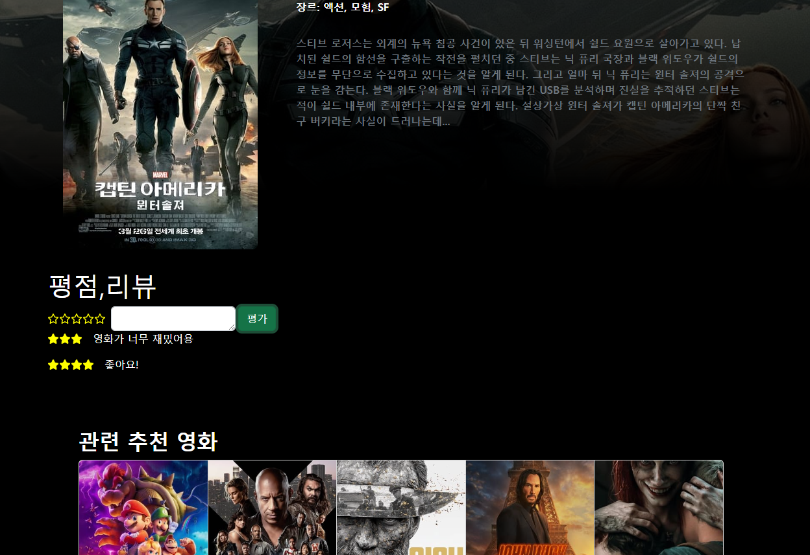

# [Movietrain] Day7_Frontend_YMY (0525)

## 오늘의 할일 

  ### 1. DESIGN 관련 회의 (오후)
      - [Layout] ArticleView
      - [Feature] MovieDetailView 별점, 코멘트 기능 구현 관련 
      - [Login] DB에 없는 정보 입력시 Modal 작동 구현 
  

  ### 2. Vue 
     1. 레이아웃(디자인) 
         - ArticleView
           - Community와 글을 쓰는 공간임을 나타낼 수 있는 배경 이미지 
           - 글쓰기 버튼 
           - 작성 글 목록 카드형태로 구현
  
     2. 라우팅 - ArticleList의 글제목 입력시 ArticleDetailView로 이동(/:id)  

  
-------------------
## 회의록
  1. ArticleView background
    - 깔끔한 화이트톤
    - 글과 관련된 것이거나 카페를 연상시키는 이미지 
  2. MovieDetailView 별점 + 평점 구현 -> Movie Info 하단에 위치  
  3. Frontend + Backend 병합 작업 (진행중 - 일부 컴포넌트 구조 수정 필요)

------
  ## (진행상황) Back, Front 연동중 

### ★★[Vue] Frontend 추가진행사항 
- 컴포넌트 구성 업데이트 필요(90%)
    
### MovieDetailView
  - 별점 구현 
    

  
## Community(ArticleView) Layout, Tone 구성 
  - 커뮤니티 레이아웃 구성 
   

    
  