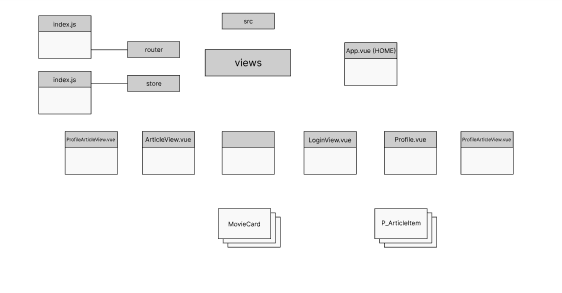
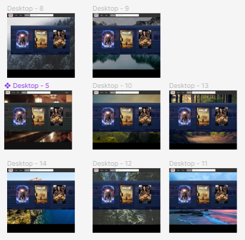
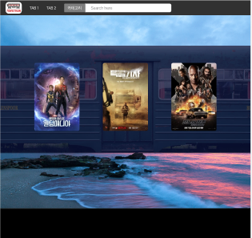
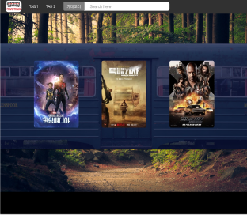
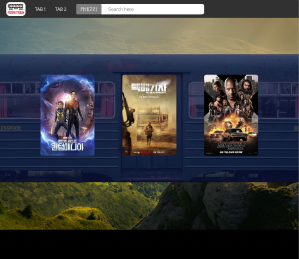
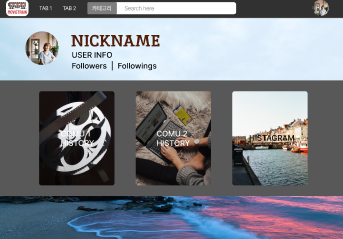

# [Movietrain] Day1_Frontend_YMY (0517)

## 오늘의 할일 

  1. MVP / 페이지 구성 회의 (오전)
  2. DESIGN Layout 초안
  3. Component Structure 초안
  

  
-------------------

  ## 진척도 

- 역할분배 및 기획안 작성, 회의 완료  
  - Backend , 기획
  - Frontend, Design 
- 컴포넌트 구성 제작 (60%)

- 디자인 레퍼런스 수집
- 디자인 레이아웃 제작(20%)
  - main page 컬러/이미지 시안 후보 
  
    - 최종 후보 
  
      
      
      
  - Profile page 대표 시안
  
    

