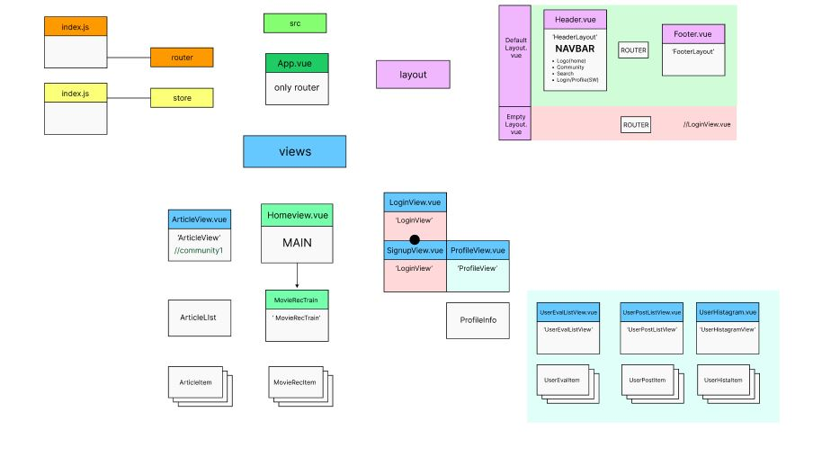

# [Movietrain] Day6_Frontend_YMY (0524)

## 오늘의 할일 

  ### 1. DESIGN 관련 회의 (오후)
      - [Layout] DetailView 
      - [Tone] LoginView / SignupView 
  

  ### 2. Vue 
     1. 레이아웃(디자인) 
         - MovieDetailView
           - ROW 1 : 해당 영화의 트레일러를 유튜브 API를 가져와서 재생
           - ROW 2 : 2개의 COLUMN으로 구성 (영화 포스터 / 정보 TEXT)
           - ROW 3 : 추천 영화 5개를 card-group 으로 구성
  
        - LoginView / SignupView
          - 컬러톤 변경, 배경 변경, 파스텔톤 그라데이션 적용 
  
     2. 라우팅 - 메인 화면에서 Movie Card 클릭시 MovieDetailView로 이동(/:id)  

  
-------------------
## 회의록
  1. LoginView / SignUpView 톤 변경
    - 로고색 반영
  2. MovieDetailView 레이아웃 회의 
  3. Frontend + Backend 병합 작업 일정 : 05/25 (Backend Auth완성시 )

------
  ## 진척도 

### ★★[Vue] Frontend 진행상황 
- 컴포넌트 구성 업데이트 
    
### MovieDetailView
  - xxl size, xl size
    
  - mid, sm size
    
  
## LoginView / SignupView Tone 및 bgimg 변경 
### LoginView
  - 
### SignupView
  - 
    
  