# [Movietrain]
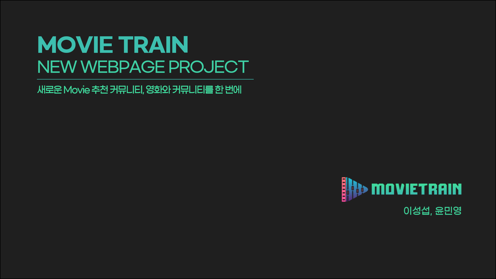
    

# 목차
- 프로젝트 소개
- Git strategy / Rules
- ABOUT (명세)
- ERD & Components
- Introduction
    

  
# 프로젝트 소개 

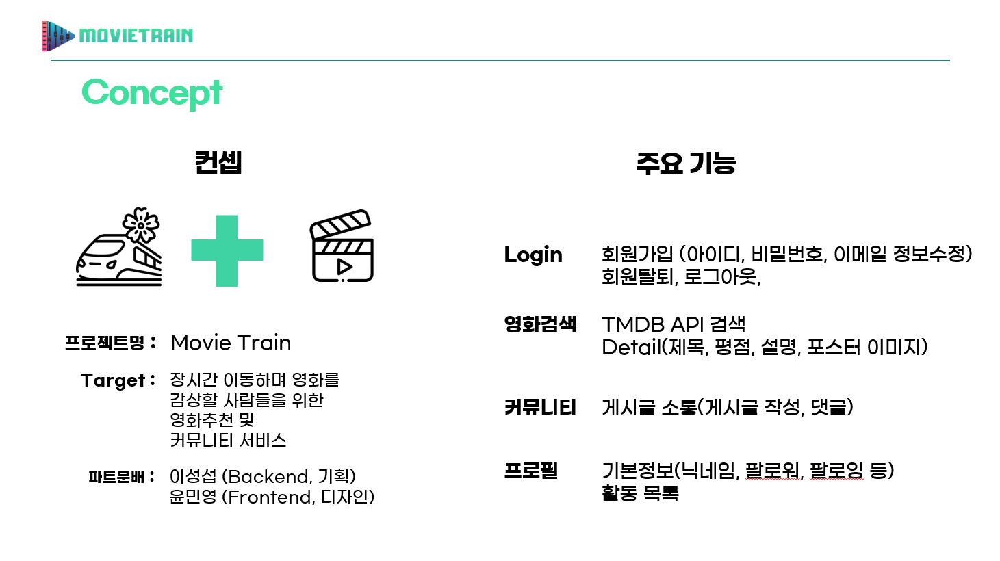
    

# Git strategy / Rules
### main : 매일 최종 수정된 버전으로 branch merge
- 1 : backend가 사용하는 브랜치
- 2 : frontend가 사용하는 브랜치 
- 매일 아침 목표 md 공유, 점심 회의, 저녁 git upload 및 readme를 통해 상황 공유
    

# ABOUT(명세)
## <개발 환경> 
### Back-end (+기획)
- Django / Python / JavaScript / SQLite / Vue
- DBdiagram / Figma / Git
- 담당자: 이성섭
### Front-end (+디자인)
- Vue / Bootstrap / Python / JavaScript
- Figma / Photoshop / Git
- 담당자: 윤민영
 

## <API 사용>
- TMDB API
- YOUTUBE API

      
# ERD (BE) & Components (FE)

## ERD 
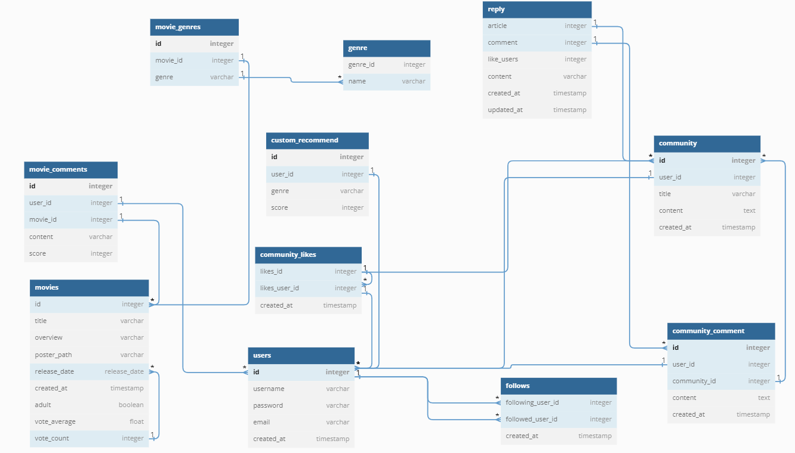

## Components
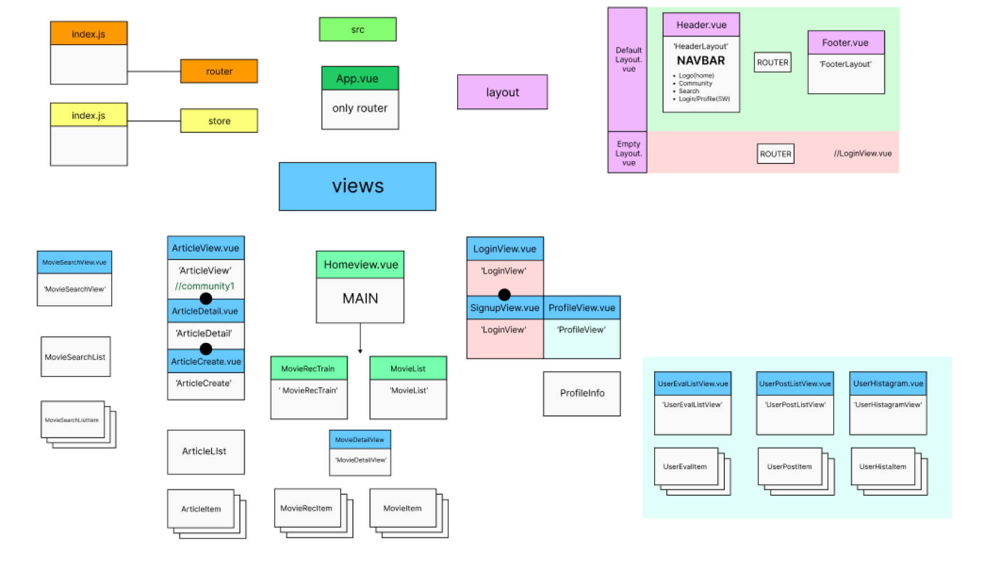
    

# Introduction
## Main Page
Display 크기에 따른 반응형 화면 구현 
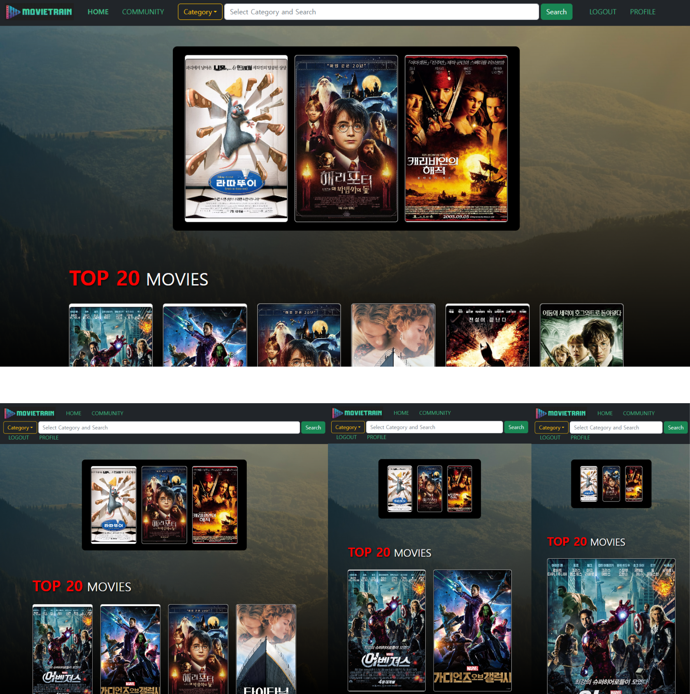
   
## Select effect (Hover)
마우스를 올릴 때 생동감을 살려줄 glow & ease effect
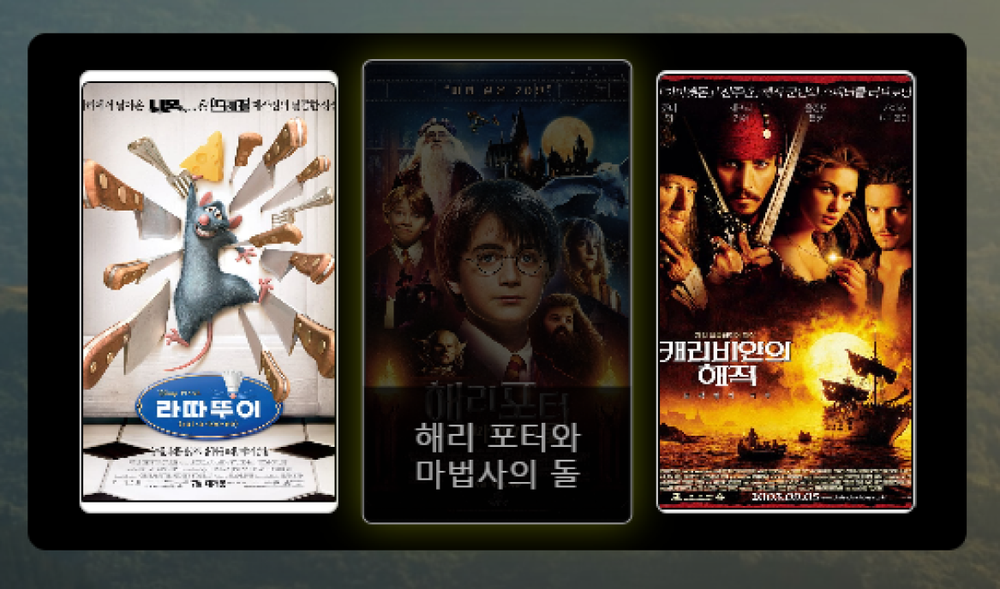
   
## 반응형 NavBar / Category Search 
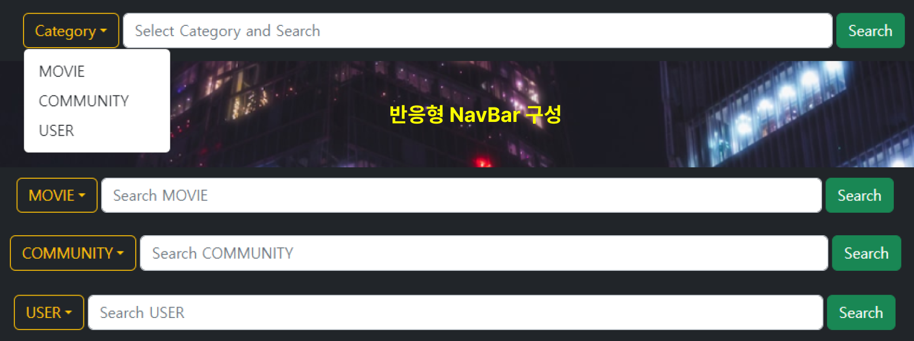
   
## Search 기능 구현
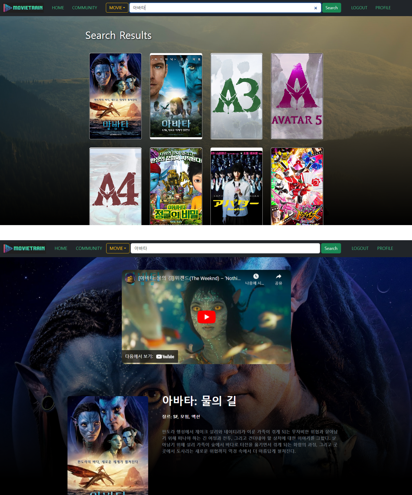
   
## Movie Detail Page
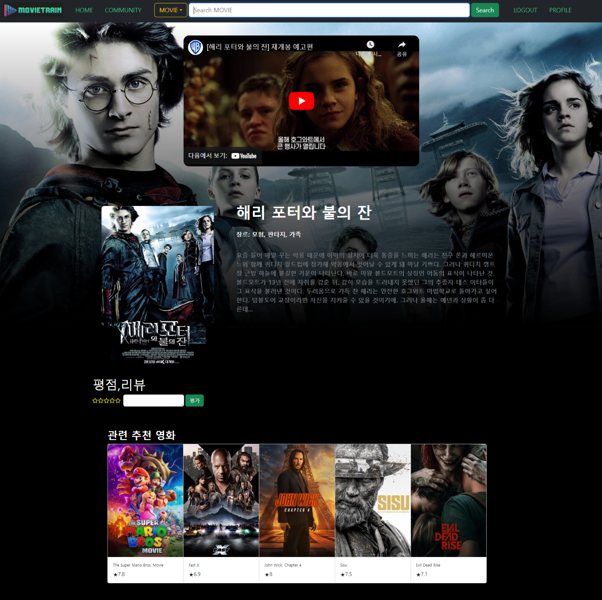
   
## Star Ranking - 평점 기능 구현
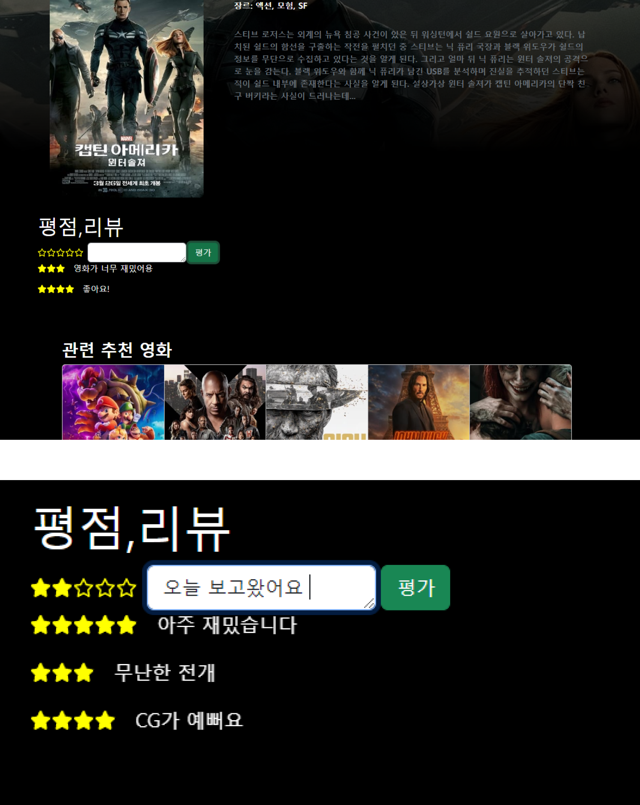
   

## Log in Page

   
## Sign up Page

   
## Profile Page
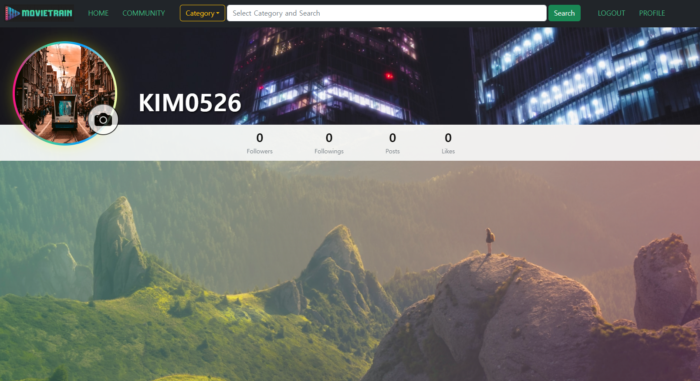
   
## Photo change - 사진 등록 기능 구현 
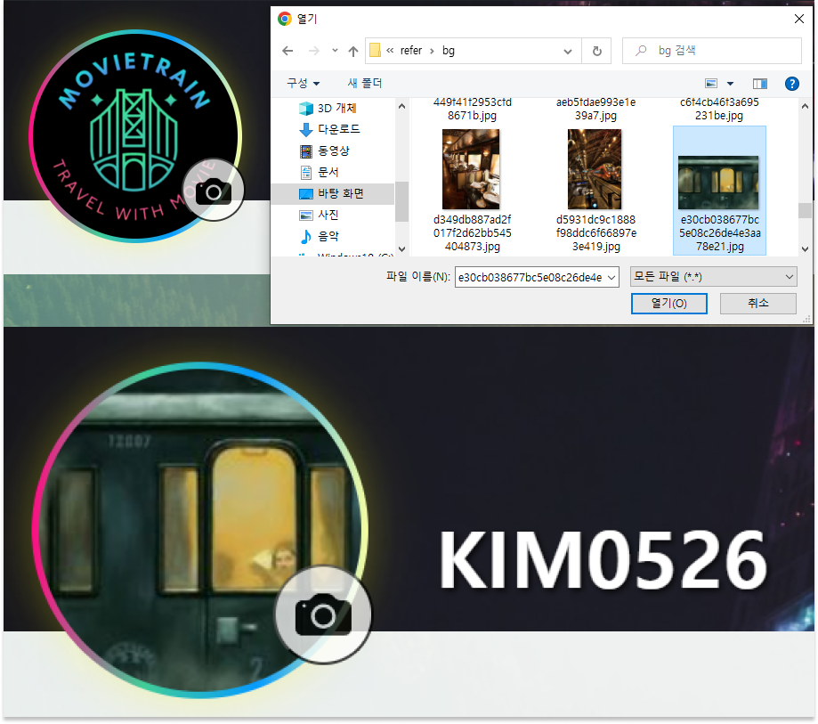
   
## Community Page - 게시판 / 글보기 
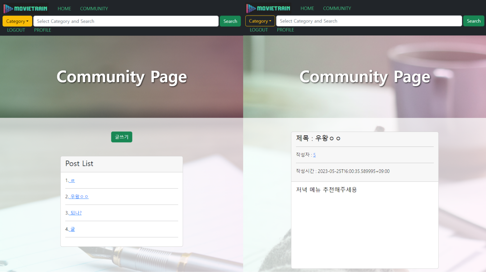
   
