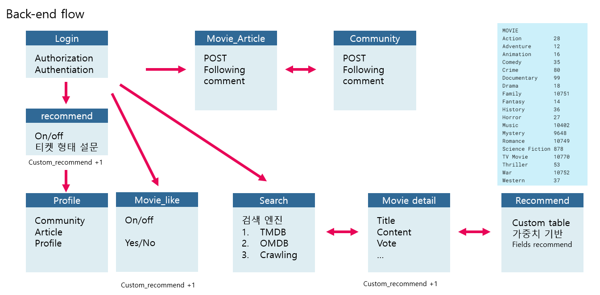
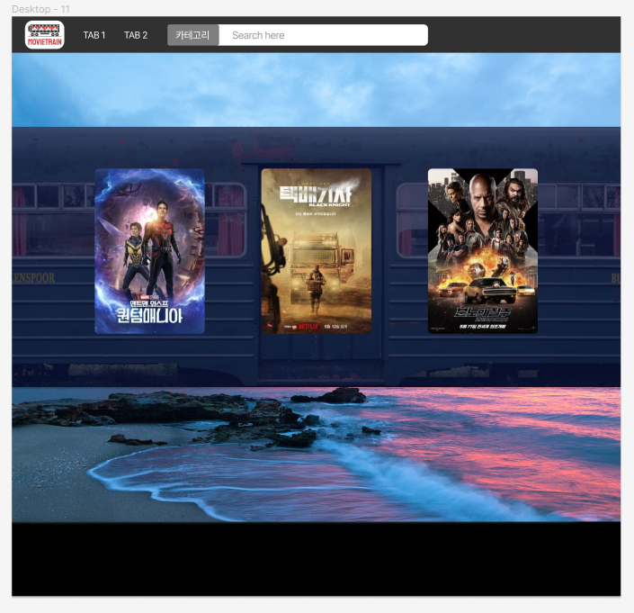
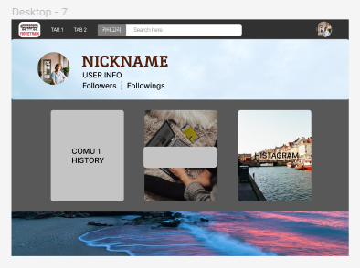

# I. 프로젝트 개요

## [1] 개요

- 프로젝트명 : MovieTrain
- 주제: 장시간 이동하며 영화를 감상할 사람들을 타겟으로 한 
         영화 추천 및 커뮤니티 서비스
- 기간: 2023.05.17 - 2023.05.25
- 발표: 2023.05.26

역할분배

- Backend, 기획 : 이성섭
- Frontend, 디자인 : 윤민영

## [2] 프로젝트 컨셉 & 주요 기능

- 프로젝트 컨셉은 ...
    - Target : 장시간 이동할 때 영화를 보는 사람들이
    - 추천 알고리즘을 통해 그날 볼 영화를 추천받고
    - 자신의 이야기를 남기거나 영화를 좋아하는 사람들과 소통한다
- 우리의 추천 알고리즘은 ...
    - custom recommend table을이용한 가중치 설정 맞춤형 영화 기능 제공
- 주요 기능(MVP)은 ...
    1. 로그인 
        1. 회원가입
            1. 아이디, 비밀번호, 닉네임, 이메일
        2. 정보수정
        3. 회원탈퇴
    2. 영화 검색
        1. DB 내 자료검색
        2. 유저 검색
        3. DB 외 타사이트 크롤링
    3. 영화 detail page
        1. 제목, 평점, 설명, 포스터이미지, 배우목록 
        2. 무비클립 — 유튜브API 이용
        3. 커뮤니티1 (게시글+ 첫번째 댓글 )
    4. 영화 추천
        1. custom_recommend table의 내림차순 정렬후 상위 2개 분야의 장르 영화 추천
        2. 값이 같으면 평점이 높은 순으로 추천  
    5. 커뮤니티 1 (영화평론)
        1. 글 추천수 , CRUD, 글쓴이나 댓글쓴이 프로필 타고 들어갈수있는거
    6. 커뮤니티 2 (자유게시판)
        1.  title/ contents/ image / comment / LIKES
    7. 프로필 페이지 
        1. 기본정보 (닉네임, 팔로워, 팔로잉 ,전체 글 추천수, 방문 횟수 ) 
            - 전체 글 추천수에 따라서 레벨업 가능
        2. 활동내역 
        (유저가 커뮤1에 쓴 글목록 / 커뮤2에 쓴 글목록/ 유저 다이어리(histagram)
    8. 유저 다이어리 ( 인스타 느낌) >> 팔로우버튼 
        1. 상태메세지 / 사진 + 오늘의 한마디  > list화 시키면 됨

---
## 오늘 한 것
1. DB - ERD 설정
https://dbdiagram.io/d/6464417ddca9fb07c43815f1

2. 컨셉 확정 및 back-end 동작 Diagram

3. mockup design

## 내일 해야 할 것
- django-backserver 구축 완료
- mockup 완료